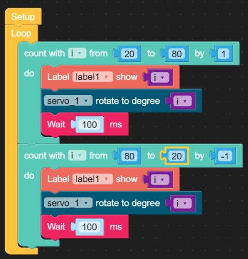

Aktoren
-------
***

> [⇧ **Home**](https://github.com/iotkitv3/intro)

Aktoren (Wandler; Antriebselemente) setzen die elektronischen Signale in mechanische Bewegung oder andere physikalische Grössen um und greifen damit aktiv in die Umgebung des eingebetteten Systems ein.

### Beispiele

* [DC Motor](#Gleichstrom-Motor) 
* [Servo](#Servo) 
* [Schrittmotor](#Schrittmotor)

### Gleichstrom Motor
***

> [⇧ **Nach oben**](#beispiele)

 

[Motoren](http://de.wikipedia.org/wiki/Elektromotor)

- - -

Elektromotor bezeichnet einen elektromechanischen Wandler (elektrische Maschine), der elektrische Energie in mechanische Energie umwandelt. In herkömmlichen Elektromotoren wird die Kraft, die von einem Magnetfeld auf die stromdurchflossenen Leiter einer Spule ausgeübt wird, in Bewegung umgesetzt.

**Anwendungen** 

*   Antrieb von Bahnen, Elektrokarren, Gabelstabel, Funkgesteuerte Modellautos (RC-Car), Robotern etc.

**M5Stack Produkte**

* [ATOM Motion](https://docs.m5stack.com/en/atom/atom_motion) zur Ansteuerung von Motoren und Servos, inkl. eines Atom Lite. Verwendet [RZ7899](http://www.rz-mic.com/uploadfile/fj/201810310633.pdf).
* [Module DC MOTOR](https://docs.m5stack.com/en/module/lego_plus) zur Ansteuerung von Lego Motoren.

### Servo 
***

> [⇧ **Nach oben**](#beispiele)

 

[http://wiki.rc-network.de/Servo](http://wiki.rc-network.de/Servo)

- - -

Der Servo (auch Rudermaschine) hat die Aufgabe, entsprechend dem Signal, dass er vom Empfänger erhält, die Ruder (oder andere Komponenten am Modell) zu stellen.

Servo lassen sich, in der Regel, von 0 - 180° bewegen. Der entsprechende Stellwinkel wird mittels eines Wert von 0.0 bis 1.0 angegeben.

Es gibt analoge und digitale Servos. Der Unterschied liegt darin, dass digitale Servo erst anfangen den Stellwinkel zu wechseln, wenn ein sauberes Signal anliegt.

Weitere Informationen und eine Ausführliche Einführung in Englisch [An Introduction to RC Servos](http://developer.mbed.org/users/4180_1/notebook/an-introduction-to-servos/)

**Anwendungen** 

*   Steuerung von Roboterarmen
*   Modellflugzeuge
*   Schalten von Weichen auf der Modelleisenbahn

**M5Stack Produkte**

* [ATOM Motion](https://docs.m5stack.com/en/atom/atom_motion) zur Ansteuerung von Motoren und Servos. Inkl. einem Atom Lite. 
* [ODrive](https://docs.m5stack.com/en/module/odrive) Hochleistungs-Servomotor-Antriebsmodul, das auf der Open-Source-Motion-Control-Lösung [ODrive](https://odriverobotics.com/) basiert.
* [Modul SERVO](https://docs.m5stack.com/en/module/servo) die Ansteuerung erfolgt via MEGA328 (wie Arduino).

* [Catch Unit](https://docs.m5stack.com/en/unit/catch) um die Möglichkeiten von Servos zu demonstrieren.

**Beispiel mit Core2 und Catch Unit an Port A** - [servo-catch-unit.m5f](servo-catch-unit.m5f)

- - -

**ACHTUNG**: der Servo zieht, am Anfang, viel Strom und schaltet den Core2 aus. Der Greifer sollte geöffnet sein, wenn das Programm geladen wird.

    from m5stack import *
    from m5stack_ui import *
    from uiflow import *
    import time
    import unit
    
    screen = M5Screen()
    screen.clean_screen()
    screen.set_screen_bg_color(0xFFFFFF)
    servo_1 = unit.get(unit.SERVO, unit.PORTA)
    
    i = None
    
    label0 = M5Label('Position', x=39, y=35, color=0x000, font=FONT_MONT_14, parent=None)
    label1 = M5Label('Text', x=148, y=34, color=0x000, font=FONT_MONT_14, parent=None)
    
    while True:
      for i in range(20, 81):
        label1.set_text(str(i))
        servo_1.write_angle(i)
        wait_ms(100)
      for i in range(80, 19, -1):
        label1.set_text(str(i))
        servo_1.write_angle(i)
        wait_ms(100)
      wait_ms(2)

### Schrittmotor
***

> [⇧ **Nach oben**](#beispiele)

Quelle M5Stack

- - - 

Ein Schrittmotor ist ein Synchronmotor, bei dem der Rotor (drehbares Motorteil mit Welle) durch ein gesteuertes, schrittweise rotierendes, elektromagnetisches Feld der Statorspulen (nicht drehbarer Motorteil) um einen minimalen Winkel (Schritt) oder sein Vielfaches gedreht werden kann.

Ein Schrittmotor hat eine fixe Schrittanzahl pro Umdrehung. 

Zur erstmaligen Positionierung wird, in der Regel, ein Endstop Schalter verwendet. [CNC Maschinen](http://de.wikipedia.org/wiki/CNC-Maschine) besitzen zusätzlich, wegen der Verletzungsgefahr einen Notstopp Schalter mit Einrastfunktion.

**Anwendungen** 

*   Typische Anwendungsgebiete sind Drucker oder der Antrieb des Schreib-/Lesekopfes in einem CDROM Laufwerken. Aufgrund ihrer hohen Genauigkeit werden sie auch in computergesteuerten Werkzeugmaschinen zur Positionierung der Werkzeuge verwendet. Durch die ständig sinkenden Kosten für die Ansteuerelektronik werden sie auch zunehmend im Konsumgüterbereich verwendet. So sind in Kraftfahrzeugen der mittleren und gehobenen Kategorie heute bis über 50 Schrittmotoren im Einsatz, die Betätigung der vielen Klappen einer automatischen Heizungs- und Klimaanlage ist dafür ein Beispiel.

**M5Stack Produkte**

* [ATOM STEPMOTOR Kit](https://docs.m5stack.com/en/atom/atomic_step_motor) komplettes Kit inkl. Atom Lite. Ansteuerung erfolgt sehr LowLevel.
* [GRBL 13.2](https://docs.m5stack.com/en/module/grbl13.2) professionelles Modul zur Ansteuerung von 3 Schrittmotoren und Abfrage von 3 Endstop Schaltern. Die Steuerung erfolgt via I2C Bus und [G-code](https://en.wikipedia.org/wiki/G-code).

