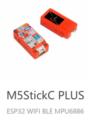
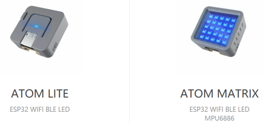
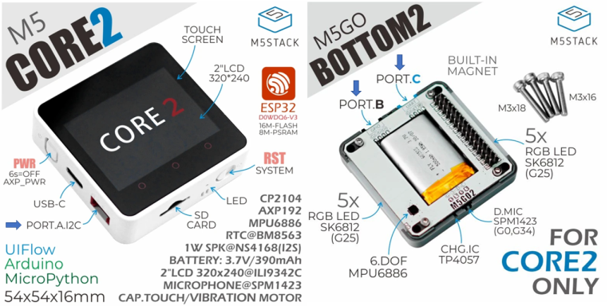

Hardware
--------
***

> [⇧ **Home**](../README.md)

### Inhaltsverzeichnis

* [Einleitung](#einleitung)
* [Main Controller](#main-controller)
* [Port(s)](#port)
* [Modules](#modules)
* [Unit(s)](#units)
* [HAT (Hardware Attached on Top)](#hats) 

### Einleitung
***

Quelle: https://docs.m5stack.com/en/products

- - -

M5Stack ist ein Technologieunternehmen, das Open-Source-Entwicklungstoolkits entwickelt und herstellt, einschließlich Hardware, Programmierplattform und IoT-Lösungen. Es wurde 2017 von Jimmy Lai gegründet und hat seinen Sitz in Shenzhen, China.

Die Produkte unterteilen sich in 
* Main Controller - die eigentlichen IoT Geräte
* Extension - wie Kameras, Sensoren und Aktoren
* Zubehör - wie Befestigungsmaterial 

### Main Controller
***

> [⇧ **Nach oben**](#inhaltsverzeichnis)

Für diese Anleitung wurden folgende Controller verwendet:

#### Stack

Quelle: [https://docs.m5stack.com/en/products](https://docs.m5stack.com/en/products)

- - -

Das sind 5 x 5 cm grosse IoT Geräte mit einem ESP32 Microcontroller, z.B.:

* [M5Stack BASIC](https://docs.m5stack.com/en/core/basic)
* [M5Stack Core2](https://docs.m5stack.com/en/core/core2) - empfohlen.

#### Stick

Quelle: [https://docs.m5stack.com/en/products](https://docs.m5stack.com/en/products)

- - -

M5Stick eignet sich als Wearable (z.B. Fitnessarmband) oder zum Steuern von Robotern wie z.B. [PuppyC](https://docs.m5stack.com/en/hat/hat-puppyc).

* [M5StickC Plus](https://docs.m5stack.com/en/core/m5stickc_plus)

### Atom

Quelle: [https://docs.m5stack.com/en/products](https://docs.m5stack.com/en/products)

- - -

Sind kostengünstige Controller (~ CHF 10.-).

* [Atom Lite](https://docs.m5stack.com/en/core/atom_lite)
* [Atom Matrix](https://docs.m5stack.com/en/core/atom_matrix)

Zusätzlich existieren [Atom Base](https://docs.m5stack.com/en/products) Produkte. Diese werden jeweils mit einem Atom Lite Controller und einem Zusatzmodul z.B. für:

* Steuerung von Motoren und Servo - [Motion](https://docs.m5stack.com/en/atom/atom_motion)
* Als Gateway, z.B. [WLAN nach RS-485](https://docs.m5stack.com/en/atom/atomic485)
* intelligente Steckdose - [Socket Kit](https://docs.m5stack.com/en/atom/atom_socket)

ausgeliefert.

### Port
***

> [⇧ **Nach oben**](#inhaltsverzeichnis)

Quelle: [https://docs.m5stack.com/en/products](https://docs.m5stack.com/en/products)

- - -

Die Controller verfügen über einen Port A, welcher i.d.R. I2C, I/O und UART Kommunikation unterstützt.

Mittels **Modules** können der Basic und Core2 um separate Anschlüsse (Buchsen) für Port B und C erweitert werden.

- Port A: I2C für den Anschluss von **Units** 
- Port B: I/O Port, i.d.R. mit ADC und DAC Möglichkeit. 
- Port C: UART für den Anschluss z.B. eines LoRaWAN Modems.

### Modules
***

> [⇧ **Nach oben**](#inhaltsverzeichnis)

Quelle: [https://docs.m5stack.com/en/products](https://docs.m5stack.com/en/products)

- - -

Sind Erweiterungen für Basic und Core, welche unten angesteckt werden können.

**Tip**: Units sind flexibler und funktionieren, i.d.R. mit allen Controllern.

### Units
***

> [⇧ **Nach oben**](#inhaltsverzeichnis)

Quelle: [https://docs.m5stack.com/en/products](https://docs.m5stack.com/en/products)

- - -

Unter **Unit** werden externe Sensoren oder Aktoren verstanden, welche mittels eines der obigen Ports mit dem Controller verbunden werden.

### HATs
***

> [⇧ **Nach oben**](#inhaltsverzeichnis)

Quelle: [https://docs.m5stack.com/en/products](https://docs.m5stack.com/en/products)

- - -

**HAT** steht als Abkürzung für: Hardware Attached on Top, Standard für Erweiterungsmodule für das M5Stack Stick.

Ausser der Schnittstelle gleiche wie **Unit**.

