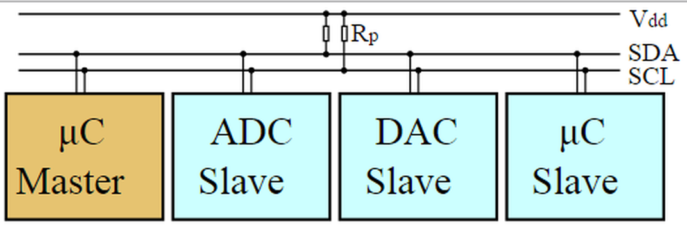

## I²C/TWI (Inter-Integrated Circuit, bzw. Two-Wire-Interface)
***

> [⇧ **Home**](../README.md)

 

[I²C-Bus mit einem Master und drei Slaves](http://de.wikipedia.org/wiki/I%C2%B2C)

- - -

I²C, für englisch Inter-Integrated Circuit, im Deutschen gesprochen als I-Quadrat-C oder englisch I-Squared-C oder I-2-C, ist ein von Philips Semiconductors (heute NXP Semiconductors) entwickelter serieller Datenbus.

Der Bus wurde 1982 von Philips eingeführt zur Geräte internen Kommunikation zwischen ICs in z.B. CD-Spielern und Fernsehgeräten.

I²C ist als **Master-Slave-Bus** konzipiert. Ein Datentransfer wird immer durch einen Master (die MCU auf dem Board) initiiert; der über eine Adresse angesprochene Slave (die Sensoren auf dem Board) reagiert darauf. Mehrere Master sind möglich (Multimaster-Mode). Im Multimaster-Mode können zwei Master-Geräte direkt miteinander kommunizieren, dabei arbeitet ein Gerät als Slave.

Der **Bustakt** wird immer vom Master ausgegeben. Für die verschiedenen Modi ist jeweils ein maximal erlaubter Bustakt vorgegeben. In der Regel können aber auch beliebig langsamere Taktraten verwendet werden, falls diese vom Master-Interface unterstützt werden. Bestimmte ICs (z.B. Analog-Digital-Umsetzer) benötigen jedoch eine bestimmte, minimale Taktfrequenz, um ordnungsgemäss zu funktionieren.

Eine **Standard-I²C-Adresse ist das erste vom Master gesendete Byte**, wobei die ersten sieben Bit die eigentliche Adresse darstellen und das achte Bit (R/W-Bit) dem Slave mitteilt, ob er Daten vom Master empfangen soll (LOW), oder Daten an den Master zu übertragen hat (HIGH). I²C nutzt daher einen Adressraum von 7 Bit, was bis zu **112 Knoten auf einem Bus** erlaubt (16 der 128 möglichen Adressen sind für Sonderzwecke reserviert).

Das Protokoll des I²C-Bus ist von der Definition her recht einfach, aber physikalisch auch recht störanfällig. Auch ist er **ungeeignet zur Überbrückung größerer Entfernungen**. Der Bus kann jedoch mit speziellen Treibern auf ein höheres Strom- und/oder Spannungslevel umgesetzt werden, wodurch der Störabstand und die mögliche Leitungslänge steigen.

Der Bus braucht zur Terminierung zwei Widerstände von ca. 2.2K - 4.7K Ohm (je nach Länge der Kabel, siehe 6-Achsen-Sensor) und alle Geräte müssen an der gleichen Ground Leitung angeschlossen sein.

**Anwendungen** 

*   Ansprechen von Peripherie Bausteinen wie Temperatursensor.
*   Ansprechen von Analog/Digital and Digital/Analog IC&#039;s.

**M5Stack Funktionen**

Quelle: [M5Stack](https://docs.m5stack.com/en/uiflow/advanced/i2c)

- - -

Der I2C Bus ist an jedem Controller als **Port A** vorhanden.

Die Verwendung der I2C Funktionen, gibt nur Sinn, wenn für ein I2C Gerät keine entsprechenden Funktionen vorhanden sind.

**M5Stack Produkte**

* [ToF - Distanzmesser](https://docs.m5stack.com/en/unit/tof)
* [Env und II - Temperatur, Feuchtigkeit und Luftdruck Sensor](https://docs.m5stack.com/en/unit/envII)
* [TVOC/eCO2](https://docs.m5stack.com/en/unit/tvoc)
* [RFID Reader](../rfid)
* [NCIR](https://docs.m5stack.com/en/unit/ncir) Infrarot- Sensor. kann verwendet werden, um die Oberflächentemperatur eines menschlichen Körpers zu messen. [Beispiel mit Core2](ncir.m5f).

**Beispiele**: in der Dokumentation **EXAMPLE** anklicken.

