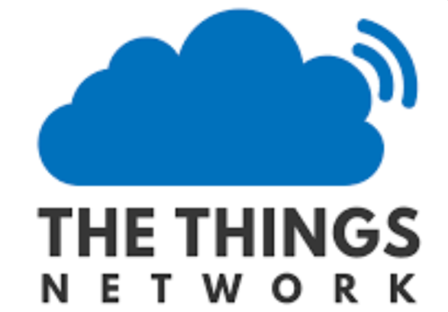

LoraWAN
-------
***

Quelle: mbed 
- - - 

Sie können sich ein LoRaWAN als Netzwerk mit virtualisierter Netzwerkschicht vorstellen. Die Geräte kommunizieren mit dem Netzwerkserver unter Verwendung des LoRaWAN-Protokolls und bilden ein LoRaWAN-Netzwerk. Wenn mehrere Basisstationen Ihr Gerät abhören, leiten alle Ihr Paket an den Netzwerkserver weiter. Dies bedeutet, dass ein LoRaWAN-Gerät nicht in einer bestimmten Zelle lokalisiert ist.

Ein LoRaWAN-Netzwerk besteht aus drei grundlegenden Netzwerkelementen:
* Gerät.
* Basisstation.
* Network Server.

Die Basisstation hat die Aufgabe, über LoRa mit den Geräten in ihrem Empfangsbereich zu kommunizieren. Die eigentliche Netzwerksteuerung liegt in der Cloud, also im Netzwerkserver.

### The Things Network
***

Quelle The Things Network
- - -

Das The Things Network (TTN) ist eine offene communitybasierte Initiative zur Errichtung eines energiesparenden Weitbereichs-Netzwerks für das Internet der Dinge.

Im öffentlichen Community-Netzwerk von The Things Network gilt eine [Fair Use Policy](https://www.thethingsnetwork.org/forum/t/fair-use-policy-explained/1300), die die **Uplink-Sendezeit auf 30 Sekunden pro Tag** und die Downlink-Nachrichten auf **10 Nachrichten pro Tag** pro Knoten begrenzt.

**Links**

* [The Things Network Console](https://eu1.cloud.thethings.network/console/applications)

### Unit LoRaWAN868
***

Quelle: M5Stack
- - -

Unit LoRaWAN868 ist ein LoRaWAN-Kommunikationsmodul, das für die 868-MHz-Frequenz geeignet ist und von M5Stack eingeführt wurde. 

Das Modul verwendet den [ASR6501](https://m5stack.oss-cn-shenzhen.aliyuncs.com/resource/docs/datasheet/unit/lorawan/ASR650X%20AT%20Command%20Introduction-20190605.pdf), das die Fernkommunikation unterstützt und sowohl einen extrem geringen Stromverbrauch als auch eine hohe Empfindlichkeit aufweist.

**AT Commands ASR6501**

**Hardware/Firmware Info**

* `AT+CGMI?` - Read Manufacturer Identification
* `AT+CGMM?` - Read Model Identification 
* `AT+CGMR?` - Read Version Identification

**Link Informationen**

* `AT+CJOINMODE=?` - Read Join Mode (0：OTAA, 1：ABP)      
* `AT+CDEVEUI=?` - Read DevEUI
* `AT+CAPPEUI?` -  Read AppEUI 
* `AT+CAPPKEY?` - Read AppKey
* `AT+CFREQBANDMASK?` - Read Frequency Band Mask (0001 = 0-7 channel, 0002 = ：8-15 channel)
* `AT+CCLASS?` - Read Class (0 = A, 1 = B, 2 = C)
* `AT+CNWKSKEY?` - Read NwkSKey
* `AT+ILOGLVL=5` - Set/Read Log Level
* `AT+DTRX?` - Send/Receive Data

