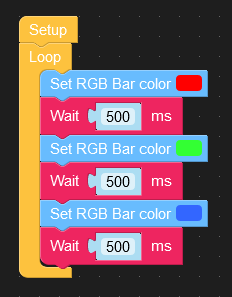
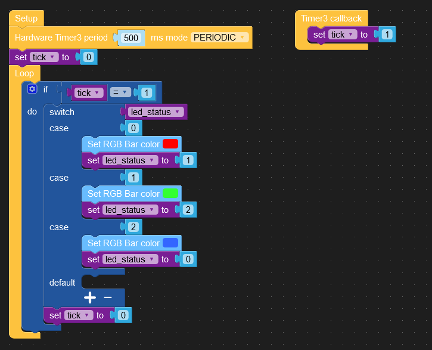
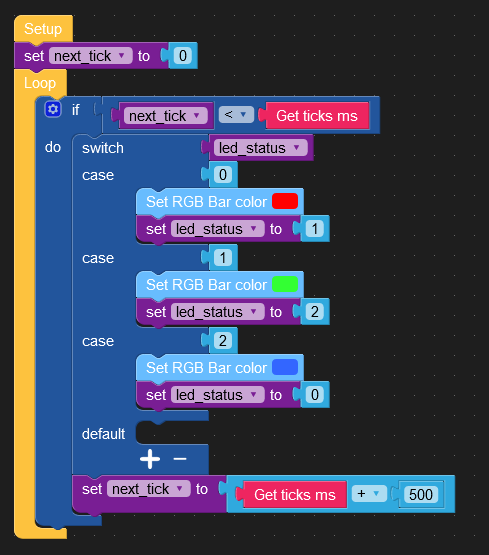

#  Ditch the delay()

Die Verwendung von delay() zur Steuerung des Timings ist wahrscheinlich eine der ersten Dinge, die Sie verwendet haben, als Sie mit dem Mikrokontroller experimentierten. Das Timing mit delay() ist einfach und unkompliziert, führt jedoch später zu Problemen, wenn Sie zusätzliche Funktionen hinzufügen möchten. Das Problem ist, dass delay() eine "beschäftigte Wartezeit" (busy wait) darstellt, die den Prozessor monopolisiert.

Während eines delay()-Aufrufs können Sie nicht auf Eingaben reagieren, keine Daten verarbeiten und keine Ausgaben ändern. Die delay()-Funktion bindet 100% der Prozessorleistung. Daher ist, wenn ein Teil Ihres Codes eine delay()-Funktion verwendet, alles andere für die Dauer lahmgelegt.

# Beispiel

Der Code im nachfolgenden Beispiel wechselt die Farben des [LED Streifen](https://shop.m5stack.com/products/m5go-battery-bottom2-for-core2-only) alle halbe Sekunde. Die drei Beispiele haben den gleichen Output zur Folge. 

## Mit Busy Wait (Nicht so!)

## Ohne Busy-Wait mit Hardware Timer

**Hinweis: In diesem Beispiel fehlt noch die Initialisierung der Zustandsvariable!**

## Ohne Busy-Wait mit Next Event Berechnung

